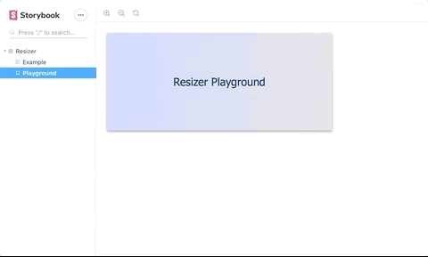

# Resizer Component (Experimental)

storybook: https://resizer.messafilip.now.sh

## Requirments

- [x] Use ES6 (with Flow) or TypeScript
- [x] Third-party apps should be able to modify styles
- [x] The example should work in Chrome, Firefox and Safari
- [x] Use React
- [ ] Add unit tests (each component should be covered)

## TODOs

- the defaultHeight and defaultWidth should handle string ('auto', '12px', '100%', etc...)
